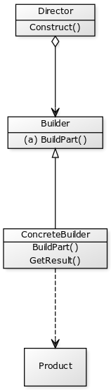

Builder
-------

#### Intent

Decouple complex objects construction from their representation.
So that same process can be reused to build objects from the same
family Useful to separate specification of an object from its actual
representation.

Can do this using abstract base classes

reference: https://sourcemaking.com/design_patterns/builder

Check List:
    1. decide if a common input and many possible representations
    exist for the problem at hand
    2. Encapsulate parsing of a common input in a reader class
    3. Design a standard protocol for all representations in a builder
    base class
    4. define a derived builder class for each target representation
    5. The client creates a Reader object and a Builder object
    registering the latter with the former
    6. The client asks the Reader to construct
    7. The client asks the Builder to return the result

#### UML

    

