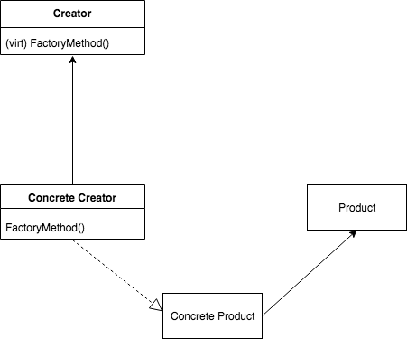

Factory Method
--------------

#### Intent

Allow subclass to figure out how to instantiate an object.

#### Applicability

When we can't anticipate how to instantiate an object.
When we want to defer instantiation to a subclass

#### UML

    

