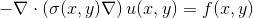
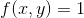
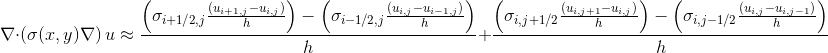
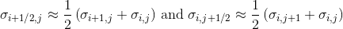

# HPC Project

We're trying to solve 

<p align="center">
    
</p>

where 


<p align="center">
    
</p>

using the following discretisation

<p align="center">
    
</p>

under the assumption that we can approximate

<p align="center">
    
</p>

i.e. by weighted means.

Here I've taken sigma to be a matrix of normally
distributed random numbers.

## Run poisson solver on OpenCL/Numpy

Create virtualenv running OpenCL, numpy and matplotlib.

```bash
python3 poisson.py
```

No parameter parsing for now

## Run fenics code using docker

I've written a small bash script for running fenics scripts on their
docker container.

Run:

```bash
chmod +x fenics
./fenics "python3 <my-fenics-script>.py
```

or add the fenics command to `.bashrc`